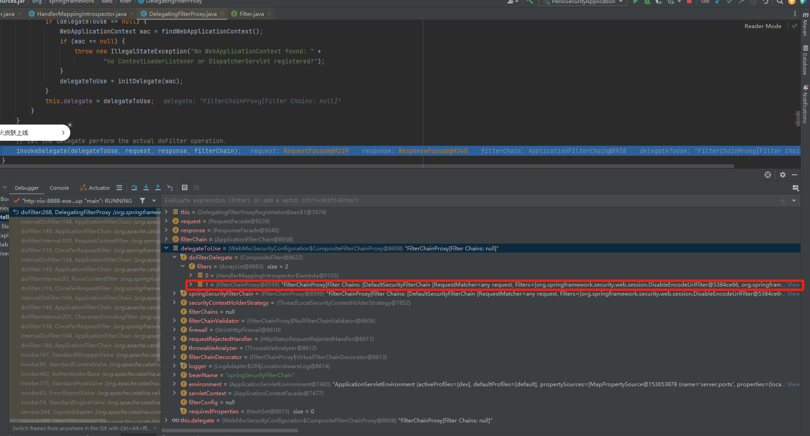
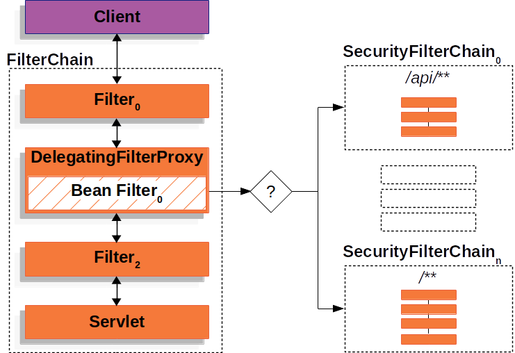

## Spring Security最小化配置启动流程

Spring Security最小化配置相关的类主要如下

```java
org.springframework.boot.autoconfigure.security.servlet.SpringBootWebSecurityConfiguration
org.springframework.security.config.annotation.web.configuration.EnableWebSecurity
org.springframework.security.config.annotation.web.configuration.SpringWebMvcImportSelector
org.springframework.security.config.annotation.web.configuration.WebSecurityConfiguration
org.springframework.security.config.annotation.web.configuration.HttpSecurityConfiguration
org.springframework.security.config.annotation.web.configuration.WebMvcSecurityConfiguration
org.springframework.boot.autoconfigure.security.servlet.SecurityAutoConfiguration
org.springframework.security.config.annotation.authentication.configuration.AuthenticationConfiguration
org.springframework.boot.autoconfigure.security.servlet.SecurityFilterAutoConfiguration
```

#### 入口SpringBootWebSecurityConfiguration

spring security boot最小配置初始化的入口为SpringBootWebSecurityConfiguration类开始的。执行注解@Import导入的SpringWebMvcImportSelector类，当环境下面存在DispatcherServlet，即为spring MVC环境的情况下，会通过org.springframework.security.config.annotation.web.configuration.SpringWebMvcImportSelector里面的selectImports()方法导入org.springframework.security.config.annotation.web.configuration.WebMvcSecurityConfiguration到Spring容器中。并实例化里面的springSecurityHandlerMappingIntrospectorBeanDefinitionRegistryPostProcessor。然后执行org.springframework.boot.autoconfigure.security.servlet.SecurityFilterAutoConfiguration#securityFilterChainRegistration()对DelegatingFilterProxyRegistrationBean进行实例化，这个bean的作用就是用来给我们的web应用中注册一个类型是DelegatingFilterProxy的过滤器，(这和在springboot应用中注册普通过滤器的方式是一样的，注册普通过滤器时给容器中注册的是FilterRegistrationBean )这个DelegatingFilterProxy 从名字看就知道是一个代理过滤器，它会把请求代理给内部的目标过滤器，这个目标过滤器的名称是通过DelegatingFilterProxyRegistrationBean的构造方法传递过去的，也就是名称为springSecurityFilterChain。

```java
	@Bean
	static BeanDefinitionRegistryPostProcessor springSecurityHandlerMappingIntrospectorBeanDefinitionRegistryPostProcessor() {
		return new BeanDefinitionRegistryPostProcessor() {
			@Override
			public void postProcessBeanFactory(ConfigurableListableBeanFactory beanFactory) throws BeansException {
			}

			@Override
			public void postProcessBeanDefinitionRegistry(BeanDefinitionRegistry registry) throws BeansException {
                //容器中是否包含名称为mvcHandlerMappingIntrospector的Bean定义信息，如果 存在就直接返回
				if (!registry.containsBeanDefinition(HANDLER_MAPPING_INTROSPECTOR_BEAN_NAME)) {
					return;
				}

				String hmiRequestTransformerBeanName = HANDLER_MAPPING_INTROSPECTOR_BEAN_NAME + "RequestTransformer";
                 //容器中是否包含名称为mvcHandlerMappingIntrospectorRequestTransformer的Bean定义信息
				if (!registry.containsBeanDefinition(hmiRequestTransformerBeanName)) {
                    //HandlerMappingIntrospectorRequestTransformer的Bean定义信息，Spring后续会根据该信息实例化Bean
					BeanDefinition hmiRequestTransformer = BeanDefinitionBuilder
						.rootBeanDefinition(HandlerMappingIntrospectorRequestTransformer.class)
						.addConstructorArgReference(HANDLER_MAPPING_INTROSPECTOR_BEAN_NAME)
						.getBeanDefinition();
					registry.registerBeanDefinition(hmiRequestTransformerBeanName, hmiRequestTransformer);
				}
				//获取springSecurityFilterChain的Bean定义，此时已经存在，可以参考org.springframework.security.config.annotation.web.configuration.WebSecurityConfiguration#springSecurityFilterChain()方法定义了该Bean的信息
				BeanDefinition filterChainProxy = registry
					.getBeanDefinition(AbstractSecurityWebApplicationInitializer.DEFAULT_FILTER_NAME);
				//判断是否为该Bean实例类型
				if (!filterChainProxy.getResolvableType().isInstance(CompositeFilterChainProxy.class)) {
                    //定义HandlerMappingIntrospectorCacheFilterFactoryBean  BeanDefinition
					BeanDefinitionBuilder hmiCacheFilterBldr = BeanDefinitionBuilder
						.rootBeanDefinition(HandlerMappingIntrospectorCacheFilterFactoryBean.class)
						.setRole(BeanDefinition.ROLE_INFRASTRUCTURE);
					
					ManagedList<BeanMetadataElement> filters = new ManagedList<>();
                    //HandlerMappingIntrospectorCacheFilterFactoryBean 
					filters.add(hmiCacheFilterBldr.getBeanDefinition());
                    //Bean名称为springSecurityFilterChain
					filters.add(filterChainProxy);
                    //定义CompositeFilterChainProxy的BeanDefinition,含有HandlerMappingIntrospectorCacheFilterFactoryBean和filterChainProxy的BeanDefinition,后续实例化的时候会用到
					BeanDefinitionBuilder compositeSpringSecurityFilterChainBldr = BeanDefinitionBuilder
						.rootBeanDefinition(CompositeFilterChainProxy.class)
						.addConstructorArgValue(filters);

					registry.removeBeanDefinition(AbstractSecurityWebApplicationInitializer.DEFAULT_FILTER_NAME);
					registry.registerBeanDefinition(AbstractSecurityWebApplicationInitializer.DEFAULT_FILTER_NAME,
							compositeSpringSecurityFilterChainBldr.getBeanDefinition());
				}
			}
		};
	}

```

#### 启动tomcat容器

由于springboot默认使用tomcat作为容器，所以这里以tomcat为例，在创建org.springframework.boot.web.servlet.context.ServletWebServerApplicationContext#createWebServer()，最终会调用org.springframework.boot.web.servlet.ServletContextInitializerBeans#addServletContextInitializerBean()方法将DelegatingFilterProxyRegistrationBean加入到initializers中，后续通过org.springframework.boot.web.servlet.AbstractFilterRegistrationBean#addRegistration()方法方法将DelegatingFilterProxy加入到ApplicationContextFacade,可以看到加入的Filter即(DelegatingFilterProxyRegistrationBean)都已经包含了Spring上下文对象applicationContext,所以后续进行Bean实例化的时候，在这些Filter中也是可以通过applicationContext直接获取的



#### 其他Bean实例化

实例化DelegatingApplicationListener，执行WebSecurityConfiguration中实例化DelegatingApplicationListener的操作，用于监听ApplicationEvent事件.然后实例化AutowireBeanFactoryObjectPostProcessor，该Bean用于将Spring Security实例化的Bean实例交给Spring容器管理。后续可以通过Spring容器直接获取Bean实例。进行enableGlobalAuthenticationAutowiredConfigurer，InitializeUserDetailsBeanManagerConfigurer和InitializeAuthenticationProviderBeanManagerConfigurer实例化，这是Spring Security三大全局配置，后续基本会一直用到这三个全局配置，并将其添加到globalAuthConfigurers集合中，然后进行AuthenticationManagerBuilder实例化，AuthenticationManagerBuilder用于构建认证管理器AuthenticationManager，后续请求认证的时候会使用到他。同时实例化DefaultAuthenticationEventPublisher，即实例化DefaultPasswordEncoderAuthenticationManagerBuilder

#### 实例化HttpSecurity和WebSecurity

执行HttpSecurityConfiguration中的httpSecurity()方法，在httpSecurity()方法中进行快捷的配置不同的SecurityConfigurer,后续会用到该配置信息。实际上HttpSecurity是一个SecurityBuilder，它最终的目的是构建SecurityFilterChain。HttpSecurity执行doBuild方法的时候通过配置的SecurityConfigurer添加一些必要的Filter，最后在执行performBuild方法将这些Filter构造成一个SecurityFilterChain。

WebSecurity 构建同样道理，通过WebSecurityConfiguration#springSecurityFilterChain()进行实例化名为springSecurityFilterChain的Filter，这个就是最终的过滤器了。

WebSecurity的本质 在有些情况下这种确实多此一举， 不过更多时候我们可能需要配置多个SecurityFilterChain来实现对多种访问控制策略。如图



为了精细化的管理多个`SecurityFilterChain`的生命周期，搞一个统一管理这些`SecurityFilterChain`的代理就十分必要了，这就是`WebSecurity`的意义。

源码如下

```java
@Override
protected Filter performBuild() throws Exception {
	Assert.state(!this.securityFilterChainBuilders.isEmpty(),
			() -> "At least one SecurityBuilder<? extends SecurityFilterChain> needs to be specified. "
					+ "Typically this is done by exposing a SecurityFilterChain bean. "
					+ "More advanced users can invoke " + WebSecurity.class.getSimpleName()
					+ ".addSecurityFilterChainBuilder directly");
					     // 过滤器链数为需要忽略的请求数加上已经配置的builder数
	int chainSize = this.ignoredRequests.size() + this.securityFilterChainBuilders.size();
	List<SecurityFilterChain> securityFilterChains = new ArrayList<>(chainSize);
	List<RequestMatcherEntry<List<WebInvocationPrivilegeEvaluator>>> requestMatcherPrivilegeEvaluatorsEntries = new ArrayList<>();
	       // 每一个忽略的请求对应的过滤器链是DefaultSecurityFilterChain
	for (RequestMatcher ignoredRequest : this.ignoredRequests) {
		WebSecurity.this.logger.warn("You are asking Spring Security to ignore " + ignoredRequest
				+ ". This is not recommended -- please use permitAll via HttpSecurity#authorizeHttpRequests instead.");
		SecurityFilterChain securityFilterChain = new DefaultSecurityFilterChain(ignoredRequest);
		securityFilterChains.add(securityFilterChain);
		requestMatcherPrivilegeEvaluatorsEntries
			.add(getRequestMatcherPrivilegeEvaluatorsEntry(securityFilterChain));
	}
	        // 已配置的securityFilterChainBuilder构建相应的过滤器链
	for (SecurityBuilder<? extends SecurityFilterChain> securityFilterChainBuilder : this.securityFilterChainBuilders) {
		SecurityFilterChain securityFilterChain = securityFilterChainBuilder.build();
		securityFilterChains.add(securityFilterChain);
		requestMatcherPrivilegeEvaluatorsEntries
			.add(getRequestMatcherPrivilegeEvaluatorsEntry(securityFilterChain));
	}
	if (this.privilegeEvaluator == null) {
		this.privilegeEvaluator = new RequestMatcherDelegatingWebInvocationPrivilegeEvaluator(
				requestMatcherPrivilegeEvaluatorsEntries);
	}
	        // 很重要，这就是最终的过滤器，将所有的过滤器链包含在里面了！！！
	FilterChainProxy filterChainProxy = new FilterChainProxy(securityFilterChains);
	if (this.httpFirewall != null) {
		filterChainProxy.setFirewall(this.httpFirewall);
	}
	if (this.requestRejectedHandler != null) {
		filterChainProxy.setRequestRejectedHandler(this.requestRejectedHandler);
	}
	else if (!this.observationRegistry.isNoop()) {
		CompositeRequestRejectedHandler requestRejectedHandler = new CompositeRequestRejectedHandler(
				new ObservationMarkingRequestRejectedHandler(this.observationRegistry),
				new HttpStatusRequestRejectedHandler());
		filterChainProxy.setRequestRejectedHandler(requestRejectedHandler);
	}
	filterChainProxy.setFilterChainDecorator(getFilterChainDecorator());
	filterChainProxy.afterPropertiesSet();

	Filter result = filterChainProxy;
	if (this.debugEnabled) {
		this.logger.warn("\n\n" + "********************************************************************\n"
				+ "**********        Security debugging is enabled.       *************\n"
				+ "**********    This may include sensitive information.  *************\n"
				+ "**********      Do not use in a production system!     *************\n"
				+ "********************************************************************\n\n");
		result = new DebugFilter(filterChainProxy);
	}

	this.postBuildAction.run();
	return result;
}
```


从上面中的源码可以看出，`WebSecurity`用来构建一个名为`springSecurityFilterChain`的Spring Bean`FilterChainProxy` 。它的作用是来定义哪些请求忽略安全控制，哪些请求必须安全控制，在合适的时候清除`SecurityContext`以避免内存泄漏，同时也可以用来定义请求防火墙和请求拒绝处理器，另外我们开启Spring Seuciry Debug模式也是这里配置的。

同时还有一个作用可能是其它文章没有提及的，`FilterChainProxy`是Spring Security对Spring framework应用的唯一出口，然后通过它与一个Servlet在Spring的桥接代理`DelegatingFilterProxy`结合构成Spring对Servlet体系的唯一出口。这样就将Spring Security、Spring framework、Servlet API三者隔离了起来。

我们事实上可以认为，`WebSecurity`是Spring Security对外的唯一出口，而`HttpSecurity`只是内部安全策略的定义方式；`WebSecurity`对标`FilterChainProxy`，而`HttpSecurity`则对标`SecurityFilterChain`

#### 打印过滤器链

为了能够在请求的时候直观的看到spring security都经过了那些过滤器，我们可以创建一个SecurityConfiguration类，并设置@EnableWebSecurity(debug = true)注解，这样在我们请求的时候就可以直观的看到经过的过滤器了，如下

```java
@Configuration
@EnableWebSecurity(debug = true)
//@EnableWebSecurity
public class SecurityConfiguration {

    @Bean
    public SecurityFilterChain securityFilterChain(HttpSecurity http) throws Exception {
        // @formatter:off
        http
                .authorizeHttpRequests((authorize) -> authorize
                        .anyRequest().authenticated()
                )
                .httpBasic(withDefaults())
                .formLogin(withDefaults());
        // @formatter:on
        return http.build();
    }
    // @formatter:off
    @Bean
    public InMemoryUserDetailsManager userDetailsService() {
        UserDetails user = User.withDefaultPasswordEncoder()
                .username("user")
                .password("password")
                .roles("USER")
                .build();
        return new InMemoryUserDetailsManager(user);
    }
    // @formatter:on

}
```

我们通过postman进行http请求如图


最终打印出的过滤器如下：后面我们会一一介绍这些过滤器

Security filter chain: [
  DisableEncodeUrlFilter
  WebAsyncManagerIntegrationFilter
  SecurityContextHolderFilter
  HeaderWriterFilter
  CorsFilter
  CsrfFilter
  LogoutFilter
  UsernamePasswordAuthenticationFilter
  DefaultLoginPageGeneratingFilter
  DefaultLogoutPageGeneratingFilter
  BasicAuthenticationFilter
  RequestCacheAwareFilter
  SecurityContextHolderAwareRequestFilter
  AnonymousAuthenticationFilter
  ExceptionTranslationFilter
  AuthorizationFilter
]

参考：[Spring Security 实战干货：WebSecurity和HttpSecurity的关系](https://cloud.tencent.com/developer/article/1818173)

