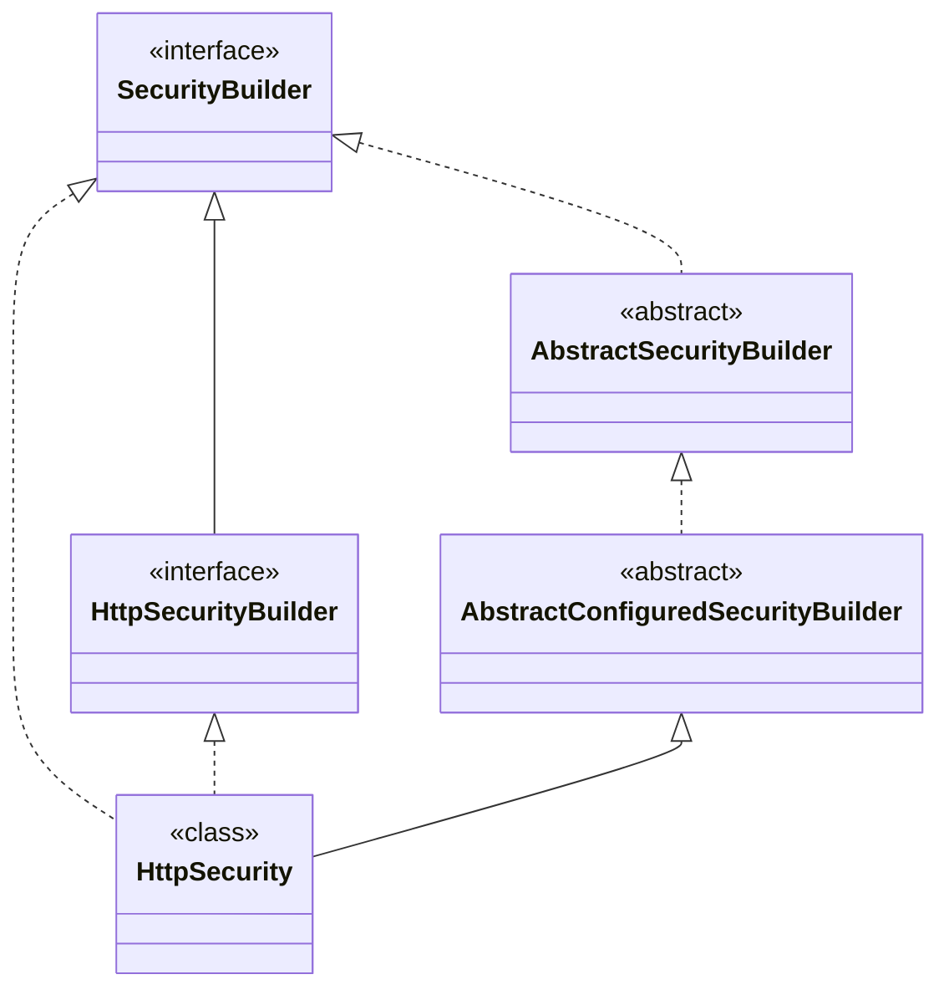

## HttpSecurity

HttpSecurity是spring security框架中的一个重要的类，其实就是一个SecurityBuilder，它最终的目的是构建SecurityFilterChain，同时也提供了很多快捷的方法创建不同的SecurityConfigurer。
HttpSecurity执行doBuild方法的时候通过配置的SecurityConfigurer添加一些必要的Filter，最后在执行performBuild方法将这些Filter构造成一个SecurityFilterChain

HttpSecurity继承关系如下



### spring security配置多SecurityFilterChain

有时候由于业务的需要，我们需要通过不同的请求进行不同的认证方式，有些时候可能存在这么一些情况，某些api 比如： /app/** 这些是给App端使用的，数据的返回都是以JSON的格式返回，而除了 /app/** 这些API之外，都是给web端使用的。

这个实际上是有HttpSecurity中的一个属性private RequestMatcher requestMatcher = AnyRequestMatcher.INSTANCE;进行控制的，我们可以通过在SecurityFilterChain实例化的时候通过http.securityMatcher()进行更改这个来控制不同的请求走不同的认证流程。

如下是我配置的不同的SecurityFilterChain

```java
@Configuration
@EnableWebSecurity(debug = true)
//@EnableWebSecurity()
public class SecurityConfiguration {


    @Bean
    @Order(1)
    public SecurityFilterChain appSecurityFilterChain(HttpSecurity http) throws Exception {
        //这里可以按照自己的需求配置不同的SecurityConfigurer,包括认证方式等等信息
        http.securityMatcher("/app/**")
                .authorizeHttpRequests((authorize) -> authorize
                        .anyRequest().authenticated()
                )
                .httpBasic(withDefaults())
                .formLogin(withDefaults())
                .exceptionHandling((exceptionHandling) ->
                        exceptionHandling.authenticationEntryPoint((request, response, authException) -> {
                                    response.setStatus(HttpStatus.UNAUTHORIZED.value());
                                    response.setCharacterEncoding(StandardCharsets.UTF_8.name());
                                    response.setContentType(MediaType.APPLICATION_JSON.toString());
                                    response.getWriter().write("{\"message:\":\"您无权访问01\"}");
                                })
                                .accessDeniedHandler((request, response, accessDeniedException) -> {
                                    response.setStatus(HttpStatus.UNAUTHORIZED.value());
                                    response.setCharacterEncoding(StandardCharsets.UTF_8.name());
                                    response.setContentType(MediaType.APPLICATION_JSON.toString());
                                    response.getWriter().write("{\"message:\":\"您无权访问02\"}");
                                }))
        ;
        return http.build();
    }


    @Bean
    @Order(2)
    public SecurityFilterChain webSecurityFilterChain(HttpSecurity http) throws Exception {
        //这里可以按照自己的需求配置不同的SecurityConfigurer,包括认证方式等等信息
        http.securityMatcher("/web/**")
                .authorizeHttpRequests((authorize) -> authorize
                        .anyRequest().authenticated()
                )
                .httpBasic(withDefaults())
                .formLogin(withDefaults());
        return http.build();
    }

    @Bean
    public InMemoryUserDetailsManager userDetailsService() {
        UserDetails user = User.withDefaultPasswordEncoder()
                .username("user")
                .password("password")
                .roles("USER")
                .build();
        return new InMemoryUserDetailsManager(user);
    }

}

```

我们故意不进行认证访问http://localhost:8888/app/hello和http://localhost:8888/web/hello,可以看到响应的内容不同，证明了请求走了不同的流程

参考：[[Spring Security 多过滤链的使用](https://segmentfault.com/a/1190000040346944)