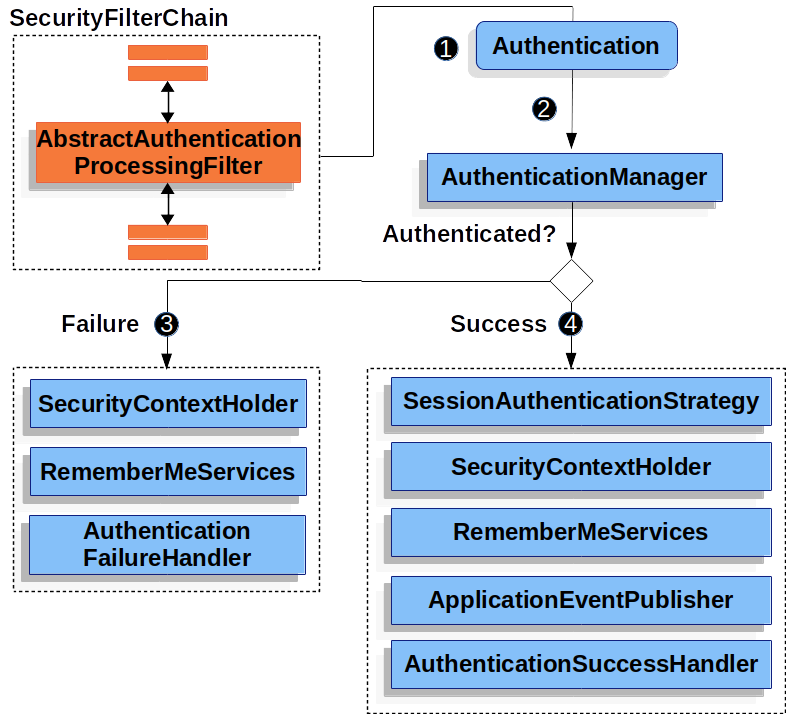
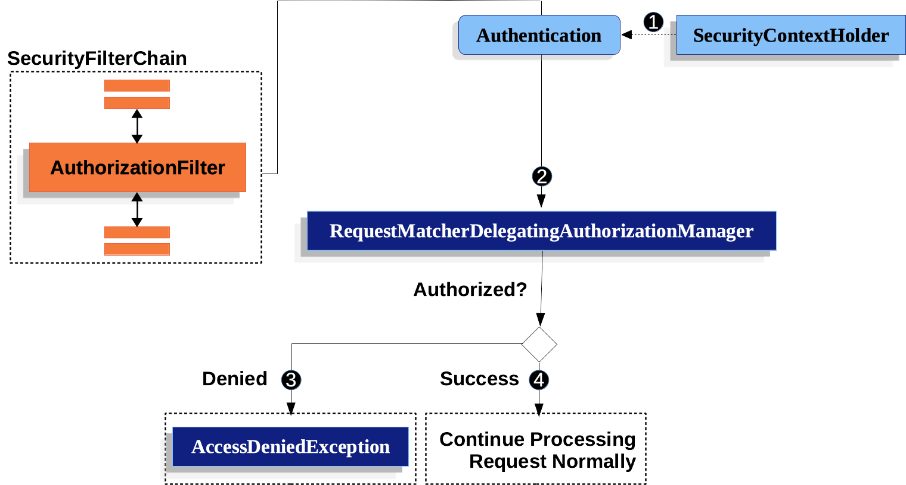

## security简介

Spring Security是一个面向Java应用程序框架，并且提供身份验证、授权和防御常见攻击的强大权限管理框架。对Spring Security进行开发依赖于spring框架。
在Spring Security中，权限管理主要包括两个方面：认证和授权。简单来说，认证就是用户的登录认证；授权就是登录成功之后，用户可以访问资源的多少。
什么是权限管理
基本上涉及到用户参与的系统都要进行权限管理，权限管理属于系统安全的范畴，权限管理实现对用户访问系统的控制 ，按照安全规则 或者 安全策略控制用户 可以访问而且只能访问自己被授权的资源。权限管理包括用户身份认证和授权两部分，简称认证授权。对于需要访问控制的资源用户首先经过身份认证，认证通过后用户具有该资源的访问权限才可访问。

### 认证

认证 ，就是判断⼀个用户是否为合法用户的处理过程。最常用的简单身份认证方式是系统通过核对用户输入的用户名和口令（密码），看其是否与系统中存储的该用户的用户名和口令⼀致，来判断用户身份是否正确。这就好比我们登录QQ、微信、游戏账号等等需要的账号和密码~

在spring security认证中使用到的组件主要如下
SecurityContextHolder:SecurityContextHolder它持有的是安全上下文（security context）的信息。当前操作的用户是谁，该用户是否已经被认证，他拥有哪些角色权等等，这些都被保存在SecurityContextHolder中。SecurityContextHolder默认使用ThreadLocal 策略来存储认证信息。看到ThreadLocal 也就意味着，这是一种与线程绑定的策略。在web环境下，Spring Security在用户登录时自动绑定认证信息到当前线程，在用户退出时，自动清除当前线程的认证信息。 例如获取用户信息：

SecurityContext：安全上下文，主要持有Authentication对象，如果用户未鉴权，那Authentication对象将会是空的。该示例可以通过SecurityContextHolder.getContext静态方法获取。

Authentication：鉴权对象，该对象主要包含了用户的详细信息（UserDetails）和用户鉴权时所需要的信息，如用户提交的用户名密码、Remember-me Token，或者digest hash值等，按不同鉴权方式使用不同的Authentication实现。Authentication是spring security包中的接口，直接继承自Principal类，而Principal是位于java.security包中的。可以见得，Authentication在spring security中是最高级别的身份/认证的抽象。由这个顶级接口，我们可以得到用户拥有的权限信息列表，密码，用户细节信息，用户身份信息，认证信息。

GrantedAuthority：该接口表示了当前用户所拥有的权限（或者角色）信息。这些信息有授权负责对象AccessDecisionManager来使用，并决定最终用户是否可以访问某资源（URL或方法调用或域对象）。鉴权时并不会使用到该对象。

UserDetails：这个接口规范了用户详细信息所拥有的字段，譬如用户名、密码、账号是否过期、是否锁定等。在Spring Security中，获取当前登录的用户的信息,一般情况是需要在这个接口上面进行扩展，用来对接自己系统的用户UserDetailsService这个接口只提供一个接口loadUserByUsername(String username)，这个接口非常重要，一般情况我们都是通过扩展这个接口来显示获取我们的用户信息，用户登录时传递的用户名和密码也是通过这里这查找出来的用户名和密码进行校验，但是真正的校验不在这里，而是由AuthenticationManager以及AuthenticationProvider负责的，需要强调的是，如果用户不存在，不应返回NULL，而要抛出异常UsernameNotFoundException

AuthenticationManager:AuthenticationManager（接口）是认证相关的核心接口，也是发起认证的出发点，因为在实际需求中，我们可能会允许用户使用用户名+密码登录，同时允许用户使用邮箱+密码，手机号码+密码登录，甚至，可能允许用户使用指纹登录，所以说AuthenticationManager一般不直接认证，AuthenticationManager接口的常用实现类ProviderManager 内部会维护一个List<AuthenticationProvider>列表，存放多种认证方式，实际上这是委托者模式的应用（Delegate）。也就是说，核心的认证入口始终只有一个：AuthenticationManager，不同的认证方式：用户名+密码（UsernamePasswordAuthenticationToken），邮箱+密码，手机号码+密码登录则对应了三个AuthenticationProvider。其中有一个重要的实现类是ProviderManager

DaoAuthenticationProvider:AuthenticationProvider最常用的一个实现便是DaoAuthenticationProvider。顾名思义，Dao正是数据访问层的缩写，也暗示了这个身份认证器的实现思路。主要作用：它获取用户提交的用户名和密码，比对其正确性，如果正确，返回一个数据库中的用户信息（假设用户信息被保存在数据库中）。
参考图片:pic/providermanagers-parent.png

下面以官方文档上得图来解释一下整个认证得流程

1、当用户提交凭证的时候，AbstractAuthenticationProcessingFilter会创建一个进行身份验证的Authentication，例如：会从提交的用户和密码中创建UsernamePasswordAuthenticationToken
2、接下来，Authentication通过AuthenticationManager进行身份验证。
3、认证失败
3.1、从SecurityContextHolder清除应用安全上下文SecurityContext
3.2、RememberMeServices.loginFail被调用。如果未配置记住我，则不做任何操作
3.3、AuthenticationFailureHandler被调用，进行认证失败的处理
4、认证成功
4.1、SessionAuthenticationStrategy收到新登录通知
4.2、Authentication在SecurityContextHolder上设置，如果您需要保存，以便在将来的请求中自动设置，则必须显式调用
4.3、RememberMeServices.loginSuccess被调用。如果未配置记住我，则不做任何操作
4.4、ApplicationEventPublisher发布了一个InteractiveAuthenticationSuccessEvent事件
4.5、AuthenticationSuccessHandler被调用,进行认证成功处理

### 授权

授权 ，即访问控制，控制谁能访问哪些资源。主体进行身份认证后需要分配权限才可访问系统的资源，对于某些资源没有权限是无法访问的。这就好比学校的网站，有学生可以访问的资源，然而老师的资源学生就无法访问~
我们看一下官方的授权流程图 

1、首先，AuthorizationFilter 从SecurityContextHolder获取 Supplier<Authentication>
2、将Supplier<Authentication>和HttpServletRequest传递给AuthorizationManager,AuthorizationManager进行匹配请求默认为RequestMatcherDelegatingAuthorizationManager，然后运行验证规则
2.1、认证失败,发布AuthorizationDeniedEvent事件并抛出AccessDeniedException异常，最终由ExceptionTranslationFilter处理AccessDeniedException异常
2.2、认证成功,发布AuthorizationGrantedEvent事件，AuthorizationFilter会正常进入到下一个过滤器

参考：[spring security系列一：核心组件](https://baijiahao.baidu.com/s?id=1711889305762686065&wfr=spider&for=pc)

